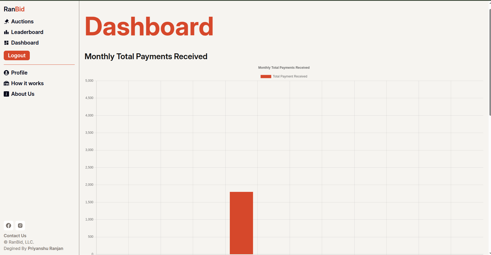
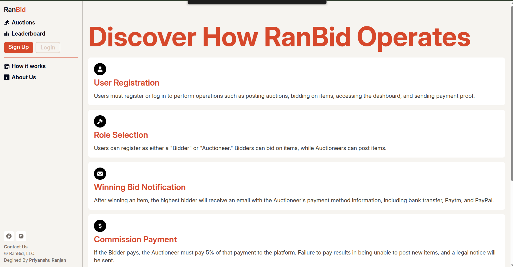
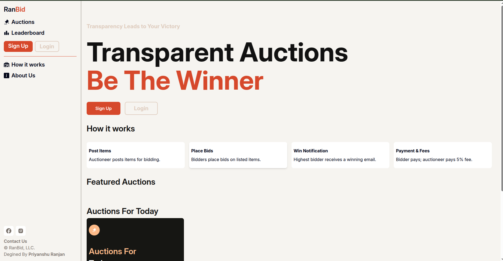
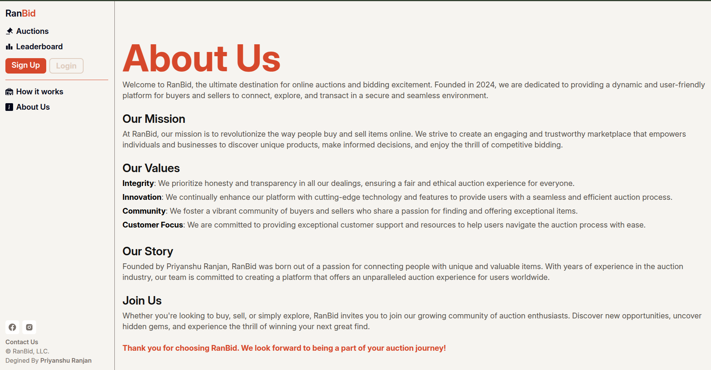

# 🏷️ RanBid - Full Stack Auction Platform

RanBid is a modern, full-stack auction platform built with the MERN stack (MongoDB, Express, React, Node.js). It features dynamic roles such as **Bidder**, **Auctioneer**, and **Super Admin**. This project is designed to handle real-time auction functionalities, automated background tasks, and an admin dashboard with live chart insights.

## 📁 Folder Structure

```
RanBid/
├── backend/       # Node.js, Express, MongoDB, APIs, Authentication, Cron Jobs
├── frontend/      # React App, Pages, Components, Styling, Tailwind
└── README.md      # Project Documentation
```

## 🌐 Live Features

### 👥 User Roles
- **Bidder**: Browse auctions, place bids, receive real-time updates.
- **Auctioneer**: Create and manage auctions, approve/reject bids.
- **Super Admin**: Complete access to the system with data visualization.

### 🛠️ Key Functionalities
- Real-time bidding system.
- Role-based access control.
- **EmailJS** integration to send real-time transactional and notification emails.
- **Cloudinary** for fast, secure media (image/file) uploads and storage.
- **Cron Jobs** using `node-cron` for:
  - Auto-ending auctions.
  - Notifying winners.
  - Updating leaderboard/status every **minute**.

### 📊 Super Admin Dashboard
- Visual real-time charts powered by libraries like Chart.js or Recharts.
- View key metrics: Active Auctions, Total Revenue, Top Bidders, etc.
- Access logs of recent activities.

## 🖼️ Screenshots




## ⚙️ Tech Stack

### Frontend
- React.js
- Redux / Context API
- Axios
- Chart.js / Recharts
- Tailwind CSS / Bootstrap (as used)

### Backend
- Node.js + Express
- MongoDB + Mongoose
- Cloudinary SDK
- EmailJS
- `node-cron` for scheduled tasks

## 📩 Automation Features

- **Email Notifications**: Automated emails for bid status, auction results, registration confirmation, etc.
- **Cron Jobs**: Auction status updates, bid expiry handling, and periodic task execution every 1 minute.

## 🚀 Getting Started

### Prerequisites
- Node.js
- MongoDB
- Cloudinary Account
- EmailJS Account

### Installation

```bash
git clone https://github.com/your-username/ranbid.git
cd ranbid
```

#### Backend Setup

```bash
cd backend
npm install
# Create a .env file and add necessary variables like DB_URI, CLOUDINARY_SECRET, EMAILJS_USER_ID, etc.
npm run dev
```

#### Frontend Setup

```bash
cd ../frontend
npm install
npm start
```


## 📈 Roadmap (Optional Enhancements)
- Payment Gateway Integration (Stripe/PayPal)
- Mobile Responsiveness
- Notification System with WebSockets
- Multi-language support

## 🧑‍💻 Author

**Priyanshu Ranjan**  
---